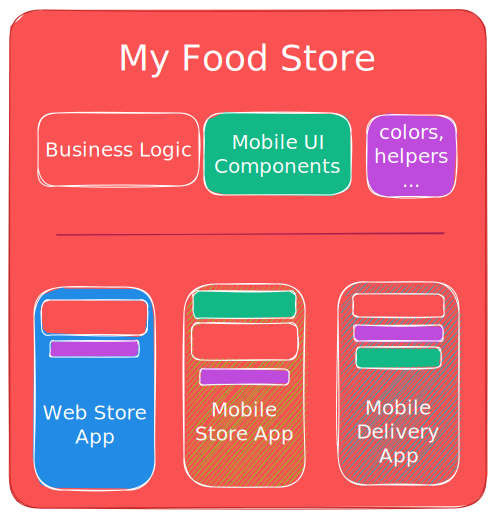

# Monorepo com Next.js (2023): Gerindo projetos complexos de forma mais simples - Um Guia teórico

Um dos problemas mais antigos que na qual as empresas já passaram ou vivem ou viverão (desde empresas como o _Google_, _Uber_, _Facebook_ à startups) está relacionada com o gerenciamento de seus projetos sobre tudo dos mais complexos, que envolvem varias equipes trabalhando em diferentes partes do software sejam elas grandes ou pequenas.
E quando isso acontece a tendência é de as empresas procurarem por formas de gerenciamento de projetos e uma das abordagens mais utilizadas é a de **Monorepo** que consistem em armazenar todas os códigos-fontes do projeto em um único repositório.
E com o **Next.js**, essa abordagem pode ser ainda mais eficiente e fácil de gerenciar.

## Sumário

- O que é Monorepo?
- Monorepo: Benefícios
- Monorepo: Desvantagens
- Next.js e Monorepo
- Conclusão
- O Projeto
- Referências
- Autor

## O que é Monorepo?

**Monorepo** ou **Monolithic Repository** é um repositório único que contém múltiplos projetos.

**Monorepo**, é uma abordagem utilizada para gerenciar projetos de software, que consiste em armazenar todos os códigos-fonte do projeto em um único repositório de código-fonte.

Em vez de manter-mos os componentes do software em partes repositórios separados com em [Turborepo](https://), a abordagem **Monorepo** todos os componentes, projetos, bibliotecas e outros são mantidos em um único lugar/repositório, facilitando as equipas que trabalham em vários projetos ao mesmo tempo com o compartilhanto de código pois os códigos usados em varias partes de diferentes projetos poderão ser abstraídos facilitando assim a manutenção do mesmo.

## Monorepo: Benefícios

1. **Facilita o compartilhamento de código entre projetos**: Com todos os projetos em um único repositório, é fácil compartilhar código e componentes entre diferentes projetos. Isso pode reduzir o tempo de desenvolvimento, evitar duplicação de código e manter a consistência entre os projetos.

2. **Simplifica a implantação de alterações em vários componentes do software**.

3. **Facilita a descoberta de dependências de código entre projetos**: Pode reduzir o risco de conflitos de mesclagem

4. **Maior visibilidade do projeto**: Em um monorepo, é mais fácil visualizar todos os projetos e componentes em um único lugar, o que pode ajudar as equipes de gerenciamento a entender melhor o escopo do projeto e a tomar decisões informadas.

5. **Facilidade de integração contínua e entrega contínua**: Com todos os projetos em um único repositório, é mais fácil gerenciar a integração contínua e entrega contínua, permitindo que as equipes de desenvolvimento trabalhem de forma mais eficiente e evitem problemas com versões desatualizadas.

## Monorepo: Desvantagens

Apesar de seus beneficios, gerenciar um **Monorepo** não deixa de ser uma tarefa desafiadora, especialmente para projetos de grande escala.

1. **Tamanho do repositório**: Com todos os projetos em um único repositório, o tamanho do repositório pode ficar grande e difícil de gerenciar, especialmente em projetos grandes. Isso pode causar problemas de desempenho e dificuldades para trabalhar com o repositório.

2. **Conflitos de código**: Com muitos desenvolvedores trabalhando em um único repositório, pode haver conflitos de código e problemas com mudanças que afetam vários projetos. Isso pode ser especialmente problemático em equipes grandes e projetos complexos.

3. **Testes**: Testar um monorepo pode ser mais complicado do que testar projetos separados, já que as alterações em um projeto podem afetar outros projetos e componentes. Isso pode aumentar a complexidade dos testes e tornar mais difícil garantir a qualidade do código.

4. **Desenvolvimento em paralelo**: Em um monorepo, pode ser difícil desenvolver projetos em paralelo, já que alterações em um projeto podem afetar outros projetos e componentes. Isso pode dificultar o trabalho de várias equipes de desenvolvimento trabalhando simultaneamente.

### Lidando com as desvantagens

## Next.js e Monorepo

O **Next.js** é um framework react utilizado para o desenvolvimento web em permitindo criar aplicações we do lado do servidor (Server Side Render) com facilidade.

O **Next.js**, além de ser o framework mais utilizado para o desenvolvimento web, possui também recuros embutidos que facilitam a implementação ou integração de **Monorepo**.

### Configurando Monorepo com NextJs

Com o Next.js, é fácil configurar um projeto de Monorepo. O Next.js fornece um conjunto de recursos para gerenciamento de dependências, como Yarn Workspaces, que permitem que você gerencie várias dependências de pacotes em um único projeto.

Além disso, o Next.js oferece suporte a uma arquitetura de componentes compartilhados, onde você pode criar componentes React compartilhados em todo o projeto. Isso pode ser especialmente útil em um projeto de Monorepo, onde os componentes precisam ser compartilhados entre várias apps.

Por exemplo, suponha que você esteja construindo uma loja on-line que consiste em um app principal e vários aplicativos secundários, como um aplicativo de gerenciamento de estoque e um aplicativo de gerenciamento de pedidos. Em um projeto de Monorepo com Next.js, você pode ter um diretório compartilhado chamado "components", onde você pode armazenar componentes React que são compartilhados em todos os apps. Isso pode incluir componentes como cabeçalhos, rodapés e barras laterais, que precisam ser exibidos em vários apps.

Outra vantagem do uso do Next.js em um projeto de Monorepo é que ele permite que você use diferentes ambientes para diferentes partes do seu projeto, permitindo uma maior flexibilidade na gestão do seu código. Por exemplo, você pode ter um ambiente de desenvolvimento separado para cada app e biblioteca compartilhada, permitindo que as equipes trabalhem em diferentes partes do projeto sem interferir no trabalho dos outros.

## Conclusão

O Monorepo é uma abordagem cada vez mais popular para gerenciamento de projetos de software complexos. E com o Next.js, essa abordagem pode ser ainda mais eficiente e fácil de gerenciar. Com os recursos embutidos para gerenciamento de dependências e compartilhamento de componentes, o Next.js é uma excelente opção para projetos de Monorepo.

No entanto, é importante lembrar que a gestão de um projeto de Monorepo ainda pode ser desafiadora, especialmente para projetos de grande escala. Certifique-se de ter uma estratégia clara para gerenciamento de dependências, testes, implantação e integração contínua e entrega contínua, e use as ferramentas certas para ajudar a simplificar o processo.

Se você está considerando usar o Monorepo em seu próximo projeto com Next.js, vale a pena experimentar e avaliar os benefícios e desafios que esta abordagem pode trazer para o seu projeto de software.

## A ter em conta

Embora, o **monorepo** seja uma abordagem eficiente para gerenciar projetos de software com múltiplos projetos ou componentes, não elimina o fato de que existam desafios a serem considerados. Ao decidir usar o monorepo, é importante avaliar as vantagens e desvantagens e avaliar se essa abordagem é adequada para o seu projeto de software específico.

Antes de decidir utilizar Monorepo a seguinte pergunta deve ser feita: _Qual é o problema que estou tentando resolver?_

## Referência

# Autor

- Name: **Dálcio Garcia**
- Role: **Front End Developer**
- Github: [dalcio](https://github.com/dalcio)
- Linkedin: [Dálcio Macuete Garcia](https://linkedin.com/in/dalcio-garcia)
- Portfolio: [dalciogarcia](https://dalciogarcia.vercel.app)
