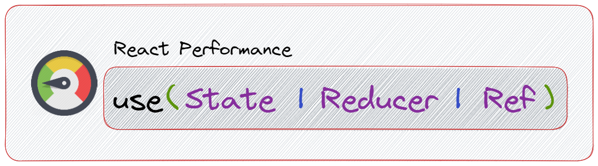

# React Performance: ```use(State | Reducer | Ref)``` theoretical summary

When we speak about development using react in the years of 2023 its dificulte not to mention in one of his game-changer, the **React Hooks**, the guilt of the easy way to manage state and lifecycle methods in functional components. However, with *great power comes great responsibility*, having this in mind, it's important to understand the **performance implications of using hooks**.

Here, we'll discute the performance implications of some of the most commonly used hooks in React: **useState**, **useReducer**, and **useRef**.

*By understanding the performance characteristics of these hooks, you can optimize your code and ensure that your application runs as efficiently as possible.*

## Summary

1. React lifecycle
2. React Hooks and performance: in a flash
3. **useState** performance implications
4. **useReducer** performance implications
5. **useRef** performance implications
6. Conclusion
7. Reference
8. About the Author

## React lifecycle

**React lifecycle** refers to the set of stages or steps that a React component goes through during its existence, from creation to destruction (from birth to death). And understanding the React lifecycle is essential for writing efficient and effective React applications, and a misunderstanding can lead to performance problems.

The React component lifecycle can be divided into three main phases: **mounting**, **updating**, and **unmounting**.

* **Mounting**: The mounting phase occurs when a functional component is first rendered. During this phase, the component function is called, and its JSX is returned. The component is then added to the DOM.

``` jsx
  useEffect(() => {
    // This peace of code refers to mounting stage
    document.title = "The Component was mounted"
  }, []); // the mounting phase is characterized ny en empty array of dependencies
```

* **Updating**: The updating phase occurs when a functional component's props or state are updated. During this phase, the component function is called again with the new props or state, and its JSX is returned. The updated JSX is then used to update the DOM.

``` jsx
  const [state, setState] = useState()

  useEffect(() => {
    // This peace of code refers to update stage
    doSomethingWithState(state)
  }, [state]); // This array of dependencies is fundamental to represent the update phase
```

* **Unmounting**: The unmounting phase occurs when a component is removed from the DOM. During this phase, the defined function is called, which allows developers to perform any necessary cleanup operations before the component is removed.

``` jsx
  useEffect(() => {
    // This will be executed when the component mounts

    const timeoutId = setTimeout(()=> {
        console.log("executing some operation on mounting")
    }, 1000)

    return function unmountingPhase(){
      // This will be executed when the component unmounts
      clearTimeout(timeoutId) // this will remove the timeout when the component unmounts
    };
  }, []);
```

## React Hooks and Performance: In a flash

React Hooks are a set of functions that allow developers to use state and other React features in functional components. They were introduced in React 16.8 and have since become a staple of React development.

Hooks can greatly improve the performance of React applications by enabling functional components to have their own state and lifecycle methods, which previously were only available in class components. This means that developers are allowed to write more concise and expressive code, as well as reuseable stateful logic across multiple components.

However, it's important to understand the performance implications of using hooks. When using hooks like **useState, useReducer, and useRef**, it's possible to accidentally trigger unnecessary re-renders, causing performance issues in your application. Additionally, if state objects are too large or if there are too many state updates in a component, this can also lead to performance problems.

## The Performance Implications of *useState*

The **useState** hook is used to manage state in a functional component. It provides a simple way to update state and trigger re-renders when the state changes. The performance implications of useState are generally minimal, as React is optimized to handle updates to state efficiently. However, if the state object is large or the component has many useState calls, this could impact performance. In such cases, it may be better to use *useReducer* instead.

Although react is optimized to handle multiple state updates efficiently to perform a single update to the component's state. It doesn't mean that we wont have a problem, and it's important to have in mind that if the state object is large or the component has many useState calls, this could impact performance.

### Tip💡🕯️

To optimize performance when using useState, it's important to keep the state object as small as possible and to limit the number of useState calls in a component. If the state object is too large, consider splitting it into smaller pieces or using useReducer instead.

## The Performance Implications of *useReducer*

The **useReducer** hook is like a super **useState**, it means an alternative to *useState* that provides a more powerful way to manage complex state. It allows you to define a reducer function that can handle multiple actions and state transitions. However, the performance implications of useReducer are similar to useState, but with some additional overhead due to the use of a reducer function.

Like **useState**, **useReducer** can cause performance issues if the state object is too large or if there are too many state updates in a component. However, in some cases, useReducer can be more efficient than useState, particularly when dealing with complex state objects or when there are many state updates.

### Tip💡🕯️

To optimize performance when using useReducer, it's important to keep the state object as small as possible and to limit the number of state updates. Additionally, you can use memoization techniques, such as React.memo or useMemo, to avoid unnecessary re-renders.

## The Performance Implications of *useRef*

useRef is a hook that allows you to create a mutable reference that persists across renders. It can be used to store a value that doesn't trigger a re-render when it changes, or to reference a DOM element directly. The performance implications of useRef are generally minimal, as it doesn't trigger re-renders and has little overhead.

However, if used improperly (e.g., creating a new useRef instance on every render), it could impact performance. Therefore, it's important to use useRef judiciously and only when necessary.

### Tip💡🕯️

To optimize performance when using useRef, it's important to only create a useRef instance when needed and to avoid creating unnecessary instances on every render.

## Conclusion

React Hooks have made it easier than ever to manage state and lifecycle methods in functional components. However, it's important to understand the performance implications of using hooks, as they can impact the overall performance of your application.

By understanding the performance implications of useState, useReducer, and useRef, you can optimize your code and ensure that your application is running as efficiently as possible. Remember to keep the state object as small

## Reference

* [React Official site](https://react.dev/)
* [React lifecycle](https://retool.com/blog/the-react-lifecycle-methods-and-hooks-explained/#:~:text=A%20React%20component%20undergoes%20three%20phases%20in%20its%20lifecycle%3A%20mounting,often%20called%20%E2%80%9Cinitial%20render.%E2%80%9D)
* [React Hooks](https://react.dev/reference/react)
* [useState](https://react.dev/reference/react/useState)
* [useReducer](https://react.dev/reference/react/useReducer)
* [useRef](https://react.dev/reference/react/useRef)

## About the Author

* Name: **Dálcio Garcia**
* Role: **Front End Developer**
* Github: [dalcio](https://github.com/dalcio)
* Linkedin: [Dálcio Macuete Garcia](https://linkedin.com/in/dalcio-garcia)
* Portfolio: [dalciogarcia](https://dalciogarcia.vercel.app)